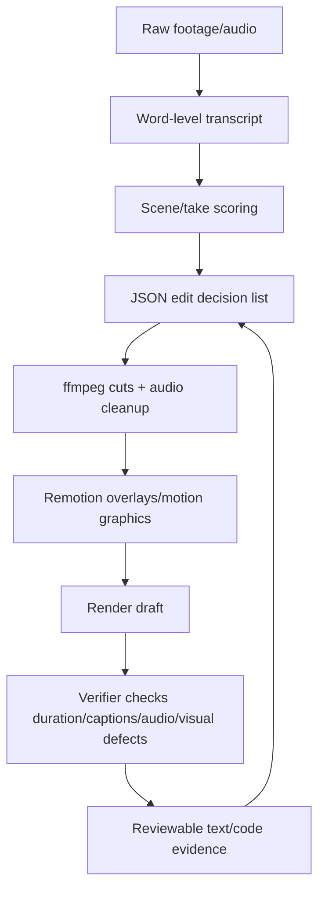

# Agent Editable Video Pipeline Workflow

```mermaid
flowchart TD
  A[Raw footage/audio] --> B[Word-level transcript]
  B --> C[Scene/take scoring]
  C --> D[JSON edit decision list]
  D --> E[ffmpeg cuts + audio cleanup]
  E --> F[Remotion overlays/motion graphics]
  F --> G[Render draft]
  G --> H[Verifier checks duration/captions/audio/visual defects]
  H --> I[Reviewable text/code evidence]
  I --> D
```

The durable asset is not just the MP4; it is the agent-readable edit system.
